# Sistema de gestão de uma Clínica Veterinária

## Descrição

Criação de um programa para gerir os serviços prestados por clínica veterinária.

O projecto proposto tem como objectivo facilitar manuseamento e armazenamento da informação a longo prazo e controle detalhado de cada movimentação, sendo que a clínica estará desprovida de meios de retenção dos dados aos seus clientes, mas com a implementação do projecto a clínica estará provida a mecanismos de gestão dos serviços prestados por uma clínica. 

A clínica em questão será responsável pelo tratamento dos animais domésticos. Onde o tratamento dos animais irá variar de acordo com a escolha do dono, como exemplo a clínica terá opções para:
- Vacinação
- Higienização
- Tratamento de doenças
- E a verificação do estado do animal “Check UP”

## Análise
- Entrada: Nome do animal, idade, cor, tipo de animal.
- Saída: Uma mensagem com o nome e estado do animal.
- Solução: Escolha do tratamento.

## Recursos:

 - Implementação em Java.  
 - Banco de Dados MySQL.  
 - Interface de Usuário Interativa com Swing.  
 - MVC (Model-View-Controller).  

## Fluxograma
Abaixo está representado o fluxograma que ilustra o funcionamento do sistema:

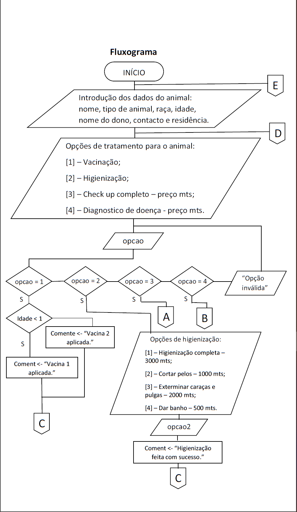
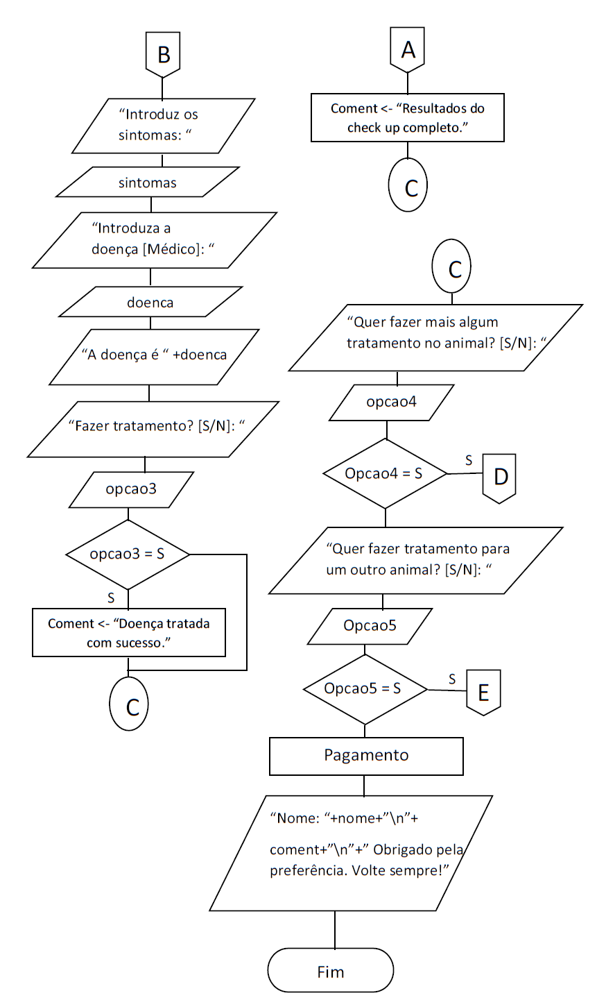

## Mockup
Abaixo temos o mockup de todas as telas do sistema:

### Tela de Login
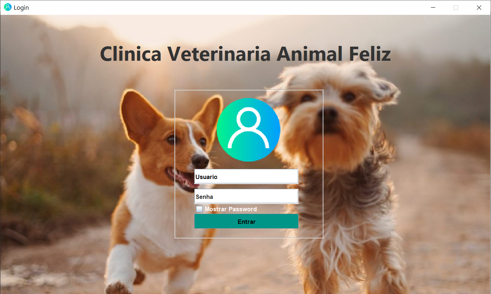

### Tela Inicial
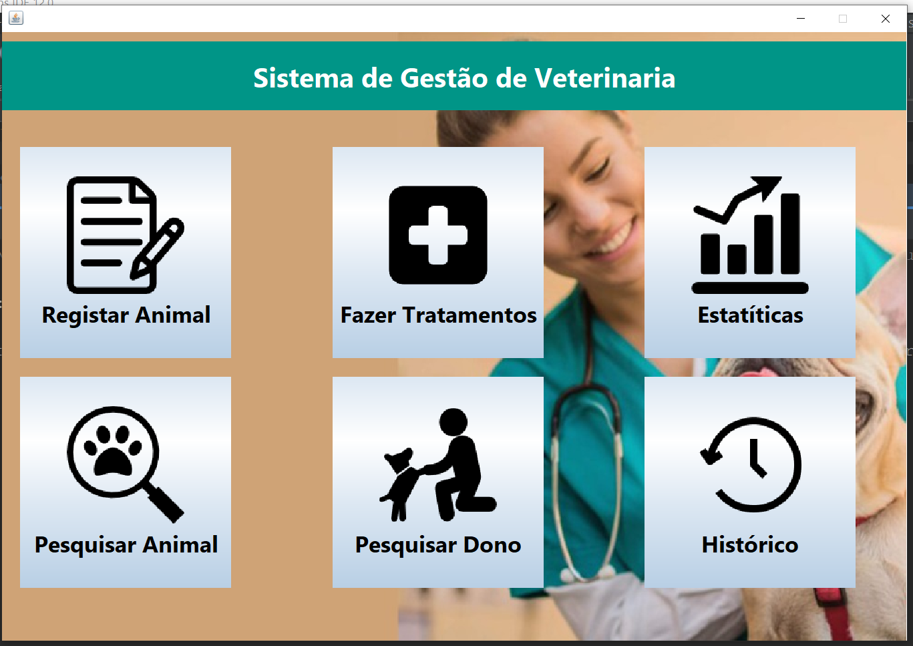

### Tela de Registo dos dados
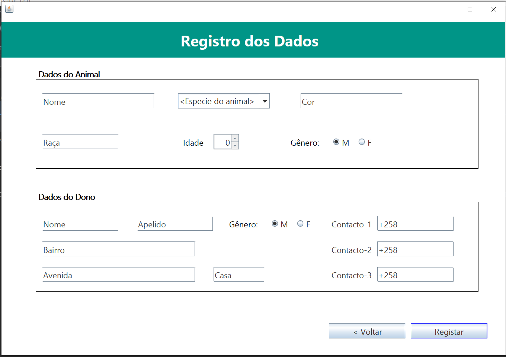

### Tela de Seleccao do animal
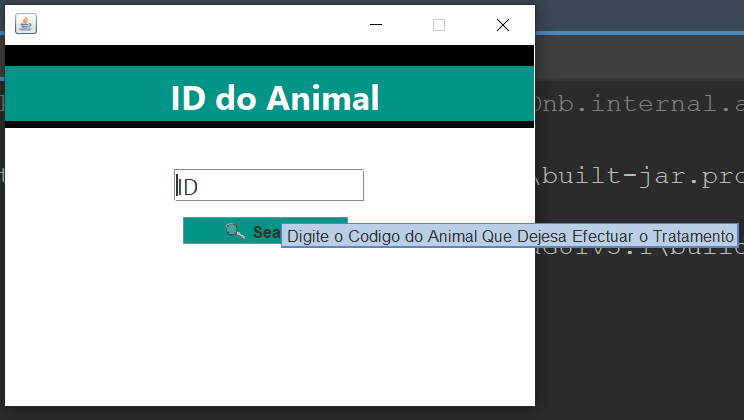

### Tela de Seleccao do Tratamento
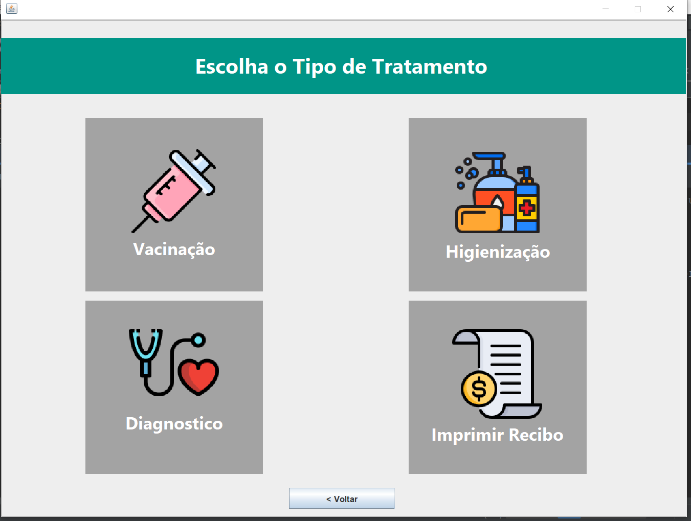

### Tela de Seleccao da Vacinacao
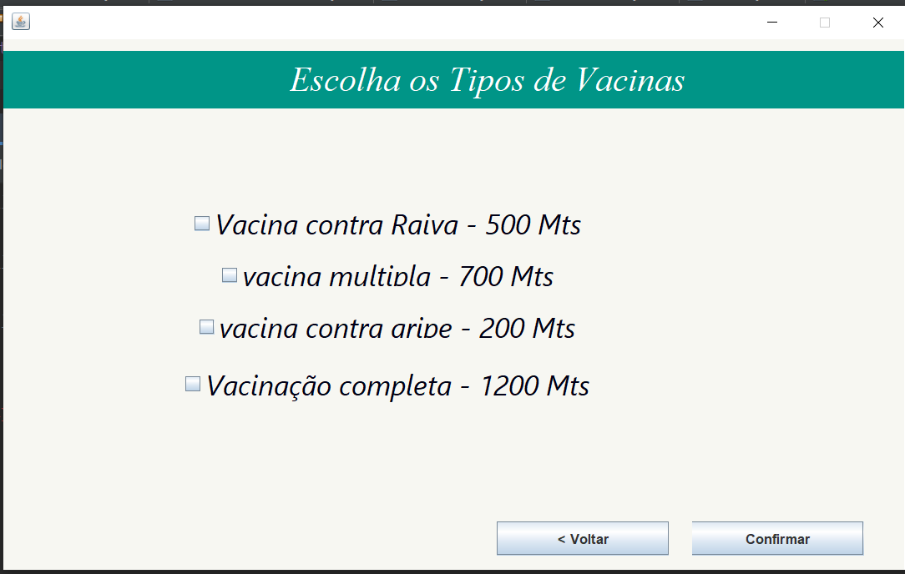

### Tela de Seleccao do Diagnostico
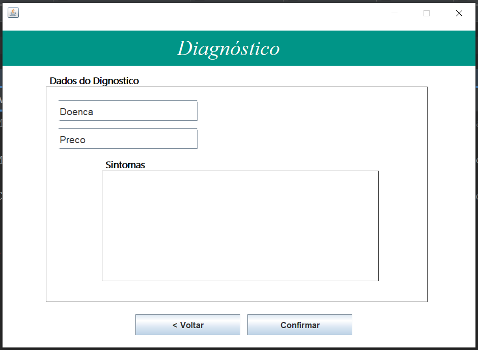

### Tela de Seleccao da Higienizacao
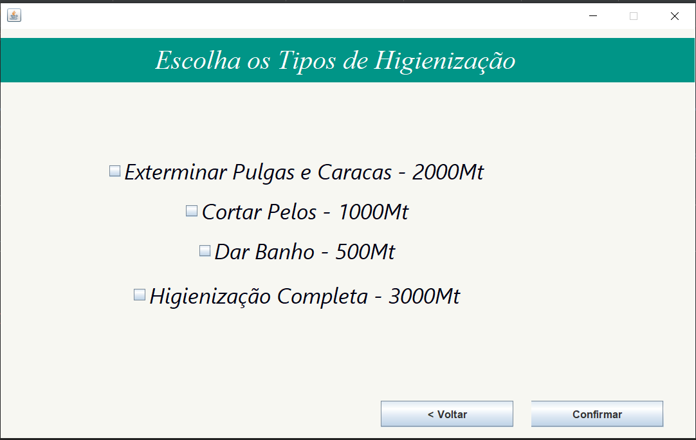

### Tela do Recibo
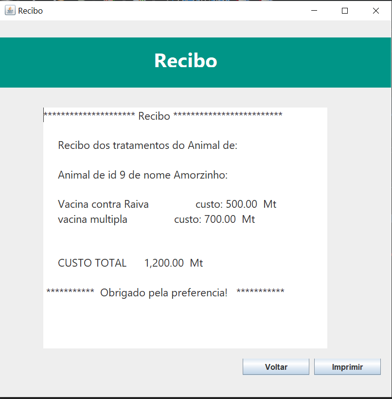

### Tela Pesquisar animal
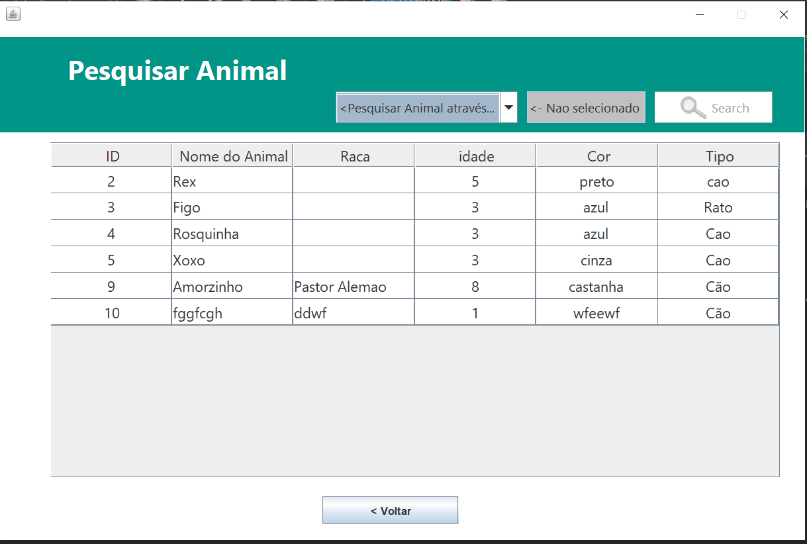

### Tela Pesquisar Dono
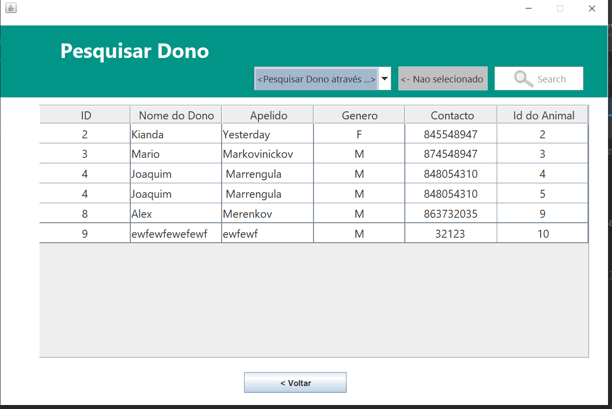

### Tela das Estatisticas
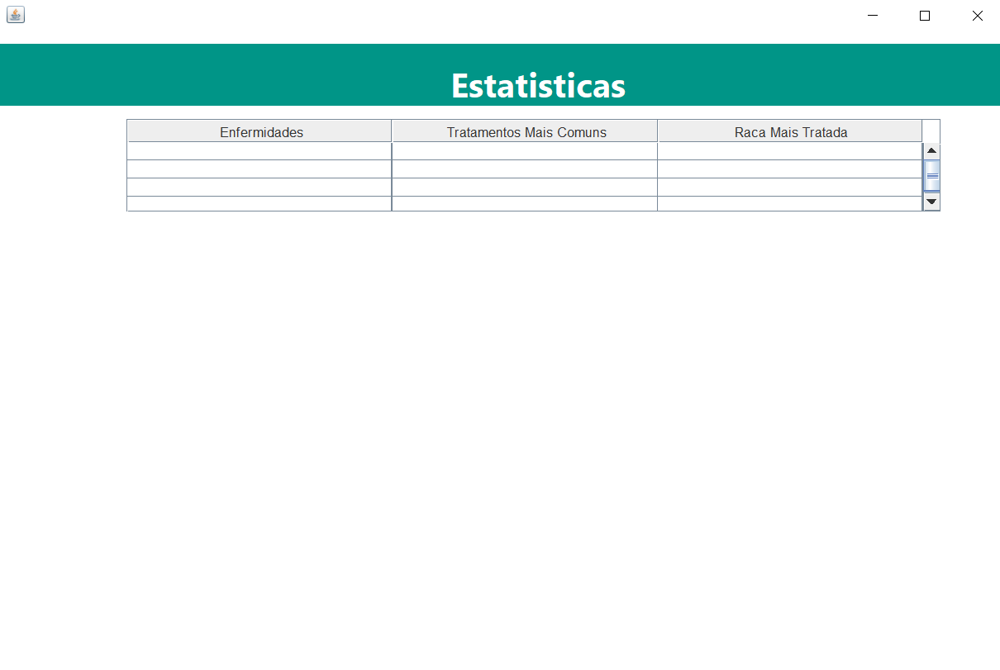

### Tela 3 de Registo do Recibo

Sinta-se à vontade para explorar o código-fonte, contribuir ou utilizar este projeto para conhecer mais da implementacao das tecnologias utilizadas.
